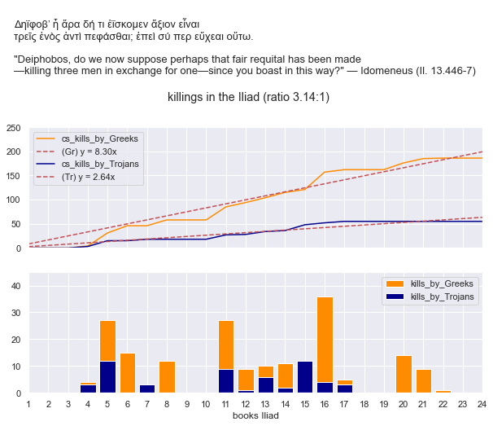

# Killings in the Iliad

Python script to produce a chart that shows the number of killings (named victims) performed by both Greeks and Trojans over the course of the *Iliad* (bar subplots),
with added cumulative sums to illustrate that the poet is adhering to a certain logic (line subplots). On average, the poet trades 3.14 Trojan death for 1 Greek death. From *Iliad* 6 onwards, this ratio is kept remarkably stable (3.1:1 — 3.4:1).

## Contents

* [Data](#data)
* [Result](#result)
* [Relevance for study of referential patterns](#relevance-for-study-of-referential-patterns)
* [Bibliography](#bibliography)
* [Contact](#contact)

### Data

The data used (csv) derives from: http://johnstoniatexts.x10host.com/homer/iliaddeaths.htm (cf. [this site](https://www.thoughtco.com/deaths-in-the-iliad-121298)).
N.B. As explained on that webpage: "line numbers refer to the on-line translation by Ian Johnston".

### Result

### Relevance for study of referential patterns

Statistics such as aforementioned ratio are to be borne in mind when considering referential patterns.* E.g. the phrase δούπησεν δὲ πεσών ('he fell with a thud') is used 19 times in the Iliad (6 times followed by ἀράβησε δὲ τεύχε’ ἐπ’ αὐτῷ, perhaps also at 15.578; cf. Kelly 2007a, 394–6), always capping a description of a warrior who has just died and always from a spear cast. 4 times this victim is a Greek, 15 times it is a Trojan. If this ratio is roughly in line with the overall total, it is still important to realize that events are not evenly spread out over the narrative. 3 out of 4 Greeks that 'fall with a thud', do so during the preparation for, and realisation and aftermath of Patroklos' death: Bathykles (16.599), Patroklos himself (16.822), Skhedios (17.311), with only 1 Trojan between them, Euphorbos (17.50), who is of course partially responsible for Patroklos' death. By contrast, the other Greek victim (13.187: Amphimakhos, Poseidon's grandson) is preceded by 5 Trojans and followed by 7. Hence, there is some reason to believe that the poet's application of the phrase to a Greek victim is meant to be understood as noteworthy.

\* Referential patterns denote narrative patterns that (seem to) exhibit 'traditional referentiality', defined by Jon Miles Foley as a deductive outgrowth of orality: "If traditional phraseology and narrative are conventional in structure, then they must also be conventional in their modes of generating meaning".

### Bibliography

- Foley, J. M. 1991. *Immanent Art: From Structure to Meaning in Traditional Oral Epic*. Bloomington, IN.

### Contact

This project was created by [@bobcorthals](https://github.com/bobcorthals). Feel free to reach out to me for any questions or comments.